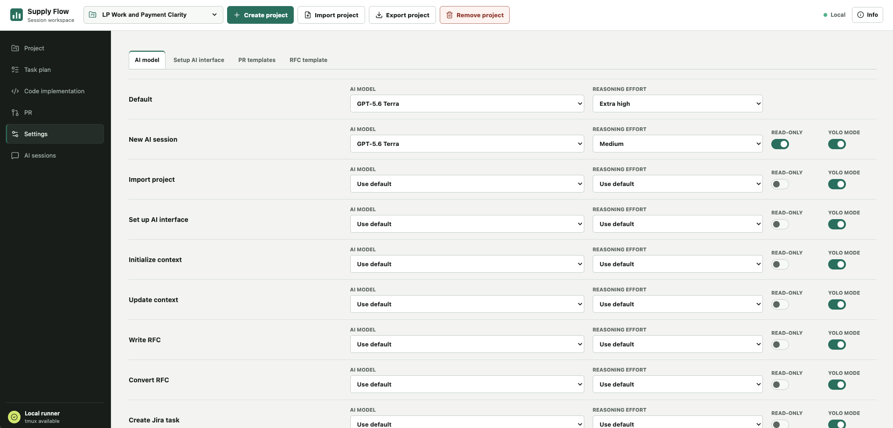
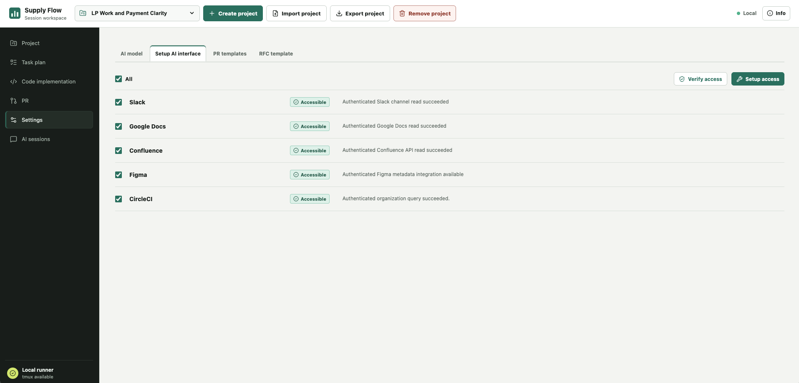
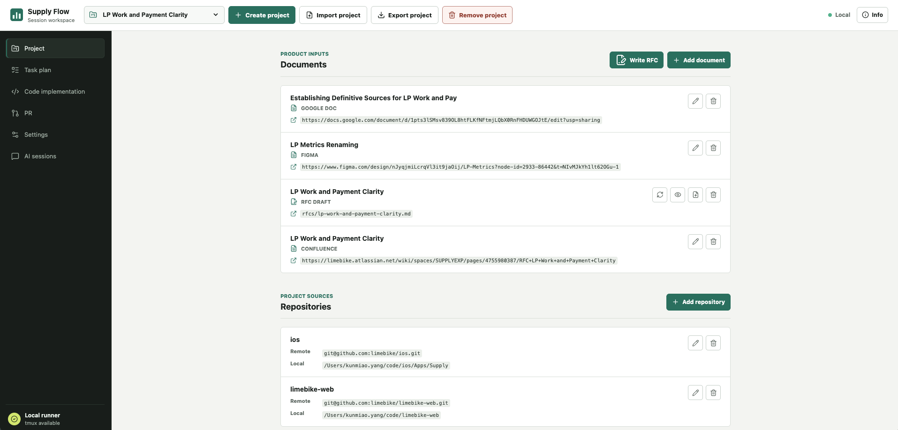
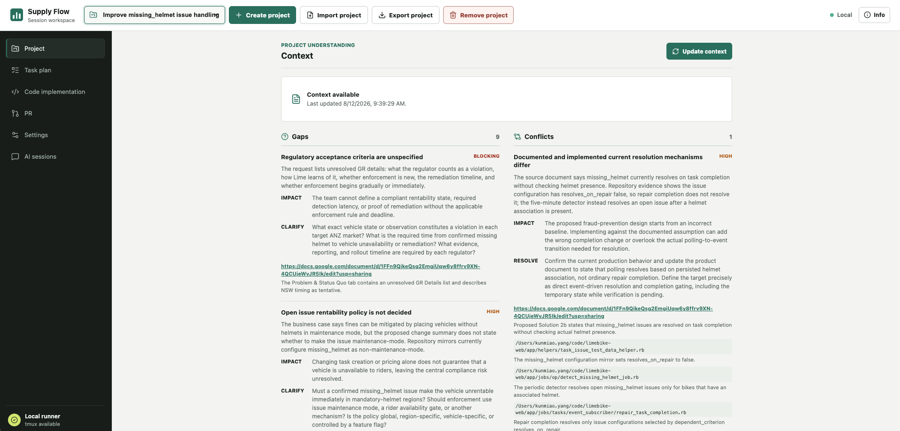
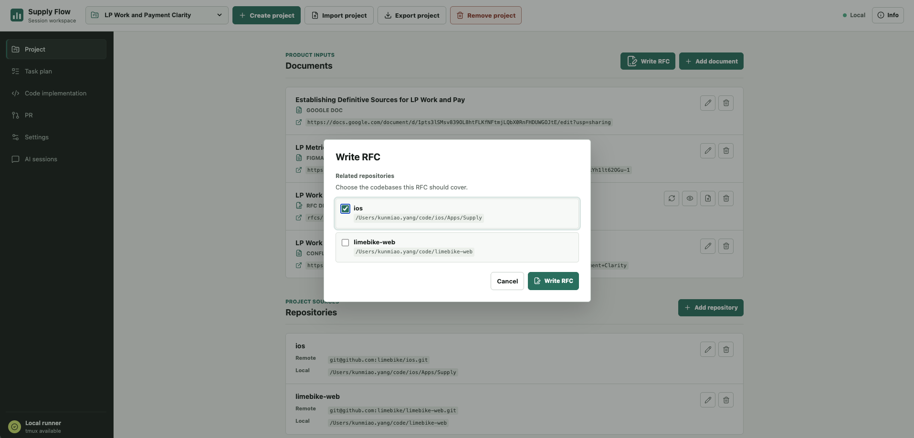
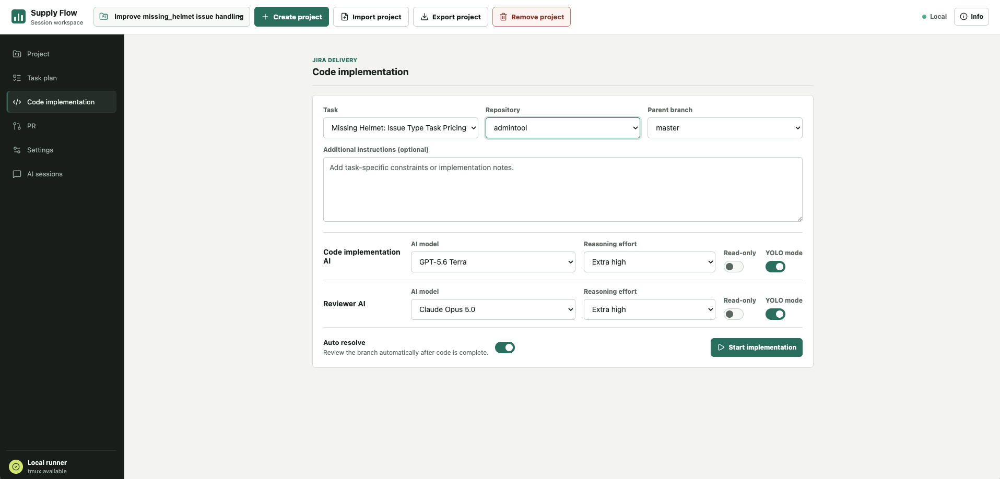
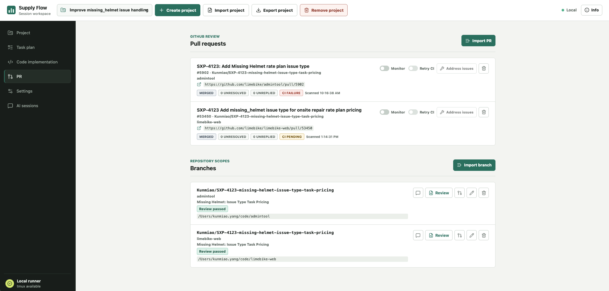
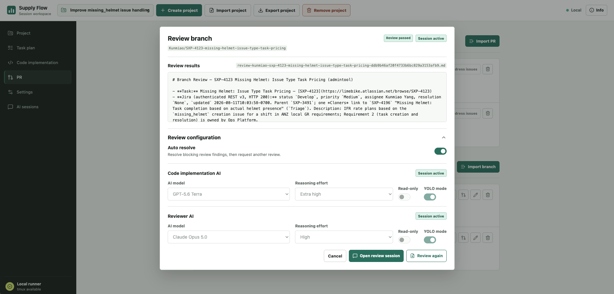
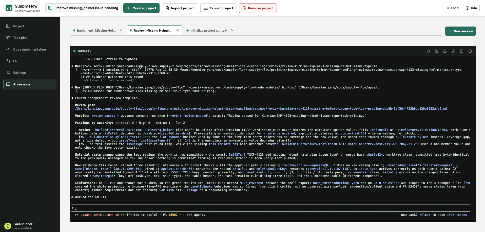

# Supply Flow

Supply Flow is an AI session control plane. Each model session runs in its own
tmux session and Git worktree. Provider-specific adapters normalize terminal
CLIs such as Codex, Claude Code, and Gemini CLI.

## Architecture

```text
Next.js web app
       |
Session runner
       |
tmux adapter
       |
Provider adapters
       |
Git worktree per session
```

The first version deliberately has no database. Session metadata is stored as
JSON and terminal events are appended to NDJSON beneath `.supply-flow/`.
Storage is isolated behind interfaces so a future Postgres implementation can
replace the file store without changing the runner or web contracts.

## Prerequisites

- Node.js 22 or newer
- npm 11 or newer
- tmux 3.3 or newer

## Setup

```sh
scripts/setup.sh
npm run dev
```

The web app starts at <http://localhost:3000>.

`scripts/setup.sh` installs missing Node.js/npm, Git, tmux, and ripgrep dependencies,
then validates their versions; installs the locked npm dependencies; creates
the ignored `.supply-flow/` state directories; and builds the web app. On
macOS it bootstraps Homebrew when needed; on Linux it uses `apt`, `dnf`, or
`pacman`. It reports AI provider CLIs and optional integration tools without
installing or authenticating them. Use `--skip-install` or `--skip-build` when
those npm install or build steps are not needed.

At least one supported provider CLI, Codex or Claude Code, must be installed
and authenticated before an AI session can start. Use **Settings > Setup AI
interface** to configure document and CI integrations after the initial setup.

## Production web app

Build the web app, then start it on the default port:

```sh
npm run build
scripts/start-web.sh
scripts/stop-web.sh
```

Both scripts default to port `3004`; pass `--port` to use another port. The
stop script also accepts `--all` to stop every Supply Flow web listener in
this checkout, including development servers.

npm command wrappers accept the same arguments:

```sh
npm run start:web -- --port 3004
npm run stop:web -- --port 3004
```

`scripts/stop-web.sh` verifies that the listener belongs to Supply Flow's
`apps/web` directory before sending it `SIGTERM`. It only stops the web
server; it does not terminate any tmux-backed AI sessions.

When the web app starts, it reconciles every project and global AI session
index against tmux. Sessions whose tmux session no longer exists are removed
from the local session index; active tmux sessions are left untouched.

## Use the web app

Open the running app in a browser, then use the project picker in the top bar
to select the current project. The selected project is retained in the URL
when navigating between workspace tabs.

### 1. Configure the workspace

1. Open **Settings > AI model** and set global or action-specific defaults for
   the AI provider, model, reasoning effort, read-only mode, and YOLO mode.
   The same page holds the provider authentication command used by the session
   terminal.
2. Open **Settings > Setup AI interface**. Select one or more integrations,
   then use **Verify access** or **Setup access**. Each action opens an AI
   session and records its outcome in local settings state.
3. Optionally edit repository-owned **PR templates** or the **RFC template** in
   Settings. These files live in `templates/`, so template changes appear in
   Git and should be committed with the project.





### 2. Create and prepare a project

1. In the top bar, select **Create project**, enter a display name, and select
   the new project from the picker.
2. On the **Project** tab, add document sources. Google Docs, Confluence,
   Figma, Slack, and local Markdown files are supported. Local Markdown files
   are copied into the project state.
3. Add repositories by their local path. Supply Flow verifies the path is
   inside a Git repository, reads the repository name and optional `origin`,
   and preserves the selected subdirectory as the project scope.
4. Under **Context**, choose **Initialize context** for a new project or
   **Update context** after document changes. The dedicated AI session writes
   or merges `context.md`, respectively. It also records identified
   requirement gaps and conflicts for the Project tab.





Use **Write RFC** to create an RFC draft from the project documents. Select the
repositories it covers so the draft is scoped to backend, frontend, or both.
RFC drafts are tracked as project documents: open them locally with **Review**,
continue work with **Update**, then use **Convert to RFC** to publish an
approved draft to Confluence.



### 3. Plan work and implement code

1. On **Task manager**, use **Import task** to add an existing Jira ticket, or
   **New task** to start a task-creation session. The AI discusses the work
   before it creates a Jira ticket. Use **Create from plan** to turn an RFC
   implementation plan into Jira sub-tasks.

2. On **Code implementation**, choose a tracked task, repository, and parent
   branch, then optionally add instructions. Configure the implementation and
   reviewer sessions if their defaults need an override.
3. Start implementation. Supply Flow creates an AI session, records the new
   ticket branch, and opens the session in **AI sessions**. The agent works
   from the project context and selected repository scope.
4. Enable **Auto resolve** when you want the implementation and reviewer
   sessions to iterate through the branch states from coding to review until
   the review passes.



### 4. Review and ship

1. On **PR**, import an existing pull request or import a local branch. For a
   tracked branch, **Track PR** finds its GitHub pull request; if none exists,
   it resumes the branch implementation session when possible or starts the
   appropriate session to create one.



2. Select **Review** on a branch to view its saved review result and launch or
   resume a review session. The dialog allows per-review AI configuration and
   enables Auto resolve for that branch.



3. On a tracked pull request, enable monitoring to refresh its review-comment
   count and CI state. Use **Address issues** to resume the associated
   implementation session or start a resolver session. Enable **Retry CI** to
   rerun retryable failed CI until it passes or the toggle is disabled.

### 5. Work with AI sessions and project data

- **AI sessions** shows global setup sessions first, followed by sessions for
  the selected project. Create an ad hoc session with **New session**, select
  provider settings, and interact with its live tmux terminal.



- Use terminal controls to refresh the tmux connection, open a native macOS
  terminal, toggle session read-only mode, or terminate the session. Use
  **Save context** on project sessions to merge durable findings into the
  project `context.md`.
- Use the top-bar **Export project** action to download a project archive.
  **Import project** accepts an archive and, when the name already exists,
  offers separate, replace, or AI-assisted merge handling.

## Runner commands

```sh
npm run runner:doctor
npm run runner -- list
npm run runner -- start codex /absolute/path/to/worktree "Review the repository"
npm run runner -- stop <session-id>
```

The `start` command launches the provider executable in a dedicated tmux
session. The provider must already be installed and authenticated by the host.

## Local state

```text
.supply-flow/
  projects/<project-id>/project.json
  projects/<project-id>/context.md
  projects/<project-id>/branches.json
  projects/<project-id>/prs.json
  projects/<project-id>/sessions.json
  projects/<project-id>/sessions/<session-id>/meta.json
  projects/<project-id>/sessions/<session-id>/events.ndjson
  projects/<project-id>/sessions/<session-id>/terminal.log
  sessions/<session-id>/... (manual runner sessions)
```

Project IDs are derived from the display name as lowercase kebab-case. A
duplicate name receives a numeric suffix, such as `customer-acme-sync-2`.
Each `project.json` contains `project_name`, `project_id`, `repos`, and
`documents` arrays. Every repository entry stores a `name`, local checkout
`local` path, and a Git-origin `remote`, which is `null` when the checkout has
no `origin`. Adding a repository validates its local path with Git, derives its
remote and name from the enclosing repository, and retains the selected local
path as the project scope. A local path may begin with `~/` as shorthand for
the current user's home directory.

Each document source stores a `type` of `google-doc`, `confluence`, `figma`,
or `slack`, together with its source `link`.

Each task stores a `title` and its Jira ticket URL in `jira_ticket`.
Creating a task starts a YOLO Codex tmux session with a title, parent ticket
link, and optional goal. The session begins with `read_only off`, loads project
context when available, and discusses the task with the user before creating
the Jira issue. After explicit approval and a successful Jira creation, it
records the new issue in `project.json`.
Tracking an existing task accepts its Lime Jira ticket link, reads the Jira
summary with the macOS Keychain credentials, and adds the title and canonical
ticket link directly to the project task list.

Code implementation starts a YOLO Codex tmux session for a selected tracked
Jira task, associated repository scope, and parent branch. The parent defaults
to `master` when available, otherwise `main`, then the first local branch.
Choices are read directly from the selected repository; default branches are
never added to `branches.json`. It begins with `read_only off`, loads project context when
available, retrieves the ticket through authenticated Jira access, follows the
established branch and Jira-transition workflow from the selected parent, adds
the resulting ticket branch to `branches.json`, runs focused validation, and
does not commit changes. Its repository-owned workflow lives in
`prompts/implement_jira_ticket.md`; it does not depend on a global Codex skill.

Each `branches.json` stores repository-scoped branch names, optional associated
Jira tickets, and the last AI session that worked on each branch. The PR
tab can import a local Git branch, edit its tracking record, open its last AI
session, or remove it from the project without changing the underlying Git
branch. Ticket branches created by the implementation workflow are associated
automatically.

Each `prs.json` stores tracked GitHub pull requests for the project. The PR tab
can import a PR belonging to an associated GitHub repository or remove a
tracking record without affecting GitHub. The branch action tracks an existing
PR; when none exists, it requires the branch's tracked Jira task and
`context.md`, then prompts a matching implementation session or creates a
dedicated YOLO Codex session to create and track the PR.

PR body templates are repository-owned under `templates/PR/`. The
`pr-template-mapping.json` file maps a normalized GitHub `owner/repository`
name to a template path relative to that directory. The PR workflow injects
the matching template into the AI session, retains its section structure, and
uses a standard summary/testing/links body when no mapping exists. The RFC
template is likewise repository-owned at `templates/rfc_template.md`. Changes
made through Settings modify these tracked files so they can be reviewed and
committed with the application.

`context.md` is created and updated by a dedicated AI session. It summarizes
the configured document sources and repository scopes for future sessions.
Any active AI session can also receive the `save_project_context.md` prompt,
which merges its durable findings into the project's `context.md` rather than
using the global Codex session archive.

`sessions.json` is the project-level session index. It is updated whenever an
AI session starts, changes status, or is terminated.

No provider credentials are written to this directory. Provider authentication
remains the responsibility of each CLI and its host environment.
